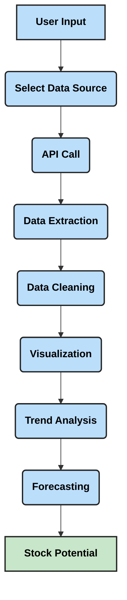

# 📈 Stock Market Data Extraction using Python  

This repository provides Python scripts and tools for extracting and analyzing **stock market data** from multiple sources (APIs & web scraping). It is designed for **data scientists, traders, and investors** who want to gather, clean, and analyze both **historical** and **real-time market data**, and explore predictive modeling for **future stock potential**.  

---

## 🚀 Features  

- ✅ **Multiple Data Sources**: Yahoo Finance, Alpha Vantage, Quandl, and more.  
- 📊 **Historical Data**: Stock prices, trading volumes, OHLC (Open-High-Low-Close).  
- ⚡ **Real-Time Data**: Live updates for intraday trading strategies.  
- 🔧 **Customizable**: Choose tickers, date ranges, frequency (daily/weekly/monthly).  
- 📉 **Data Analysis**: Preprocessing, visualization, trend analysis.  
- 🔮 **Future Insights**: Predict stock potential using statistical and ML models.  
- 🛠️ **Easy-to-Use**: Python-based API with clean functions.  

---

## 📋 Software Requirement Specification (SRS)  

### 1. Introduction  
- **Purpose**: To build a stock market data extraction & analysis system for **historical, real-time, and predictive analysis**.  
- **Users**: Traders, Data Scientists, Researchers, Students.  
- **Scope**: Provide a Python toolkit to fetch, clean, and analyze stock data with future trend forecasting.  

### 2. Functional Requirements  
- Fetch stock data from APIs (Yahoo Finance, Alpha Vantage).  
- Perform historical trend analysis.  
- Support real-time data monitoring.  
- Provide data visualization (candlesticks, line charts).  
- Enable predictive analytics (ARIMA, LSTM, Prophet).  

### 3. Non-Functional Requirements  
- **Performance**: Handle multiple tickers efficiently.  
- **Scalability**: Extendable to more APIs.  
- **Usability**: Simple API calls.  
- **Security**: Secure API key handling.  

### 4. System Requirements  
- **Python 3.8+**  
- Libraries: `pandas`, `numpy`, `matplotlib`, `yfinance`, `alpha_vantage`, `requests`  
- Internet connection (for live API fetches)  

---

## 🎯 Minimum Viable Product (MVP)  

The MVP focuses on:  
1. Extracting **historical stock data** (daily/weekly/monthly).  
2. Fetching **real-time intraday stock updates**.  
3. **Data visualization** (price trends, candlestick charts).  
4. Exporting stock data to **CSV/Excel**.  
5. Running **basic forecasting models** (ARIMA or Prophet) for potential stock movement.  

Future versions will include **LSTM deep learning models**, portfolio optimization, and sentiment analysis.  

---

## 🔄 Workflow  

### 📌 Stock Data Extraction & Forecasting Flow  



---

## 📊 Data Extraction & Prediction Flow  

1. **Data Sources**  
   - Yahoo Finance (`yfinance`) → Historical + real-time stock data.  
   - Alpha Vantage → Fundamental + technical indicators.  
   - Quandl → Economic and financial datasets.  

2. **Data Preprocessing**  
   - Cleaning missing values  
   - Adjusting stock splits & dividends  
   - Converting to desired frequency (daily/weekly/monthly)  

3. **Visualization**  
   - Line graphs for price trends  
   - Candlestick charts for trading patterns  
   - Volume analysis  

4. **Prediction Models**  
   - **Statistical**: ARIMA for short-term forecasting.  
   - **ML/DL**: LSTM for long-term sequence modeling.  
   - **Prophet**: Seasonality-aware forecasting.  

5. **Output**  
   - CSV/Excel exports  
   - Graphs with predicted trends  
   - Insights into **potential stock performance**  

---

## ⚙️ Installation & Usage  

```bash
# Clone the repository
git clone [https://github.com/Rishi-gupta-data/Stock-Data-extraction.git]

# Navigate to project
cd Stock-Market-Data-Extraction

# Install dependencies
pip install -r requirements.txt
```

### Example Usage  

```python
import yfinance as yf

# Fetch historical data
data = yf.download("AAPL", start="2020-01-01", end="2023-01-01")
print(data.head())

# Fetch real-time stock info
ticker = yf.Ticker("AAPL")
print(ticker.info)
```

---

## 📚 Documentation  

Detailed examples and API references are available in the `docs/` folder.  

---

## 🤝 Contributing  

Contributions are welcome!  
- Fork the repo  
- Create a new branch  
- Commit your changes  
- Submit a pull request  

---

## 📜 License  

This project is licensed under the **MIT License** - see the [LICENSE](LICENSE) file for details.  
